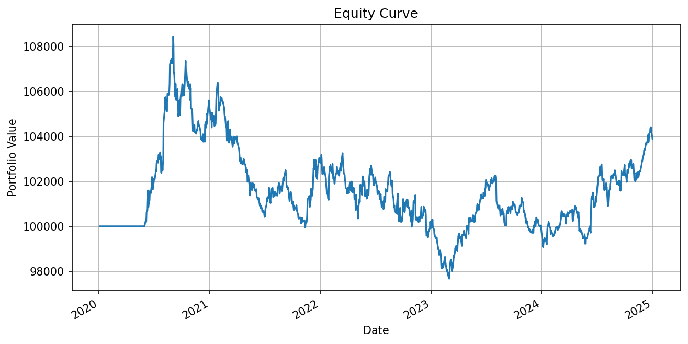

# Simple moving averages strategy and backtest
This project presents a **simple moving average crossover strategy** applied to a single equity asset, **Apple Inc. (AAPL)**. The strategy is implemented and backtested using the **zipline-reloaded** library, producing performance metrics and visualizations over a specified historical period.

### Strategy Overview
The strategy operates on **daily close prices** of Apple Inc. (AAPL) and generates trading signals using **simple moving averages (SMA)**.

Two moving averages are used:

- **Short-term moving average:**  
  Computed over **one trading month (21 trading days)**

- **Long-term moving average:**  
  Computed over **three trading months (63 trading days)**

---

## Trading Logic

The trading rules follow a classic moving average crossover logic:

- **Long Position:**  
  When the 21-day moving average crosses **above** the 63-day moving average,  
  the strategy enters a **long position equal to 15% of the total portfolio value**.

- **Short Position:**  
  When the 21-day moving average crosses **below** the 63-day moving average,  
  the strategy enters a **short position equal to 10% of the total portfolio value**.

Position sizing is expressed as a percentage of the current portfolio value and is handled using Zipline’s `order_target_percent` function.

---

## Transaction Costs Assumptions

The backtest accounts for basic market frictions:

- **Commission costs:**  
  A fixed commission of **$0.01 per share traded**

- **Slippage:**  
  A fixed slippage of **$0.01 per trade**

These assumptions aim to provide a conservative and realistic estimate of trading performance.

---

### Performance Metrics

| Metric | Value |
|------|------|
| Total Return | 3.89% |
| Annualized Return | 0.76% |
| Annualized Volatility | 3.622% |
| Sharpe Ratio | 0.22 |
| Maximum Drawdown | -9.95% |
| Number of Trades | 520 |
| Win Rate | 49.6% |

Win rate is computed as the percentage of profitable trading days.

The strategy is profitable on an absolute basis, though the total return is low, indicating a low-to-moderate return profile.

The annualized return is relatively low, suggesting that the strategy prioritizes stability or exploits small but persistent inefficiencies rather than generating high directional returns.

A Sharpe ratio of 0.22 is low, implying that the risk-adjusted performance is weak. Institutional-grade strategies typically target Sharpe ratios above 1.0, or at least above 0.5 for low-volatility systems.

A drawdown close to 10% is significant relative to the annualized return, indicating periods of prolonged underperformance and highlighting the importance of drawdown control in risk management.

### Portfolio Value vs Cash Balance

Portfolio value represents the total value of the strategy at a given point in time, including both cash and open positions. It is computed as the sum of available cash and the market value of long positions, net of short positions.

As a result, the ending cash balance may be lower than the initial capital if part of the portfolio is invested in open positions at the end of the backtest. Performance metrics are therefore evaluated based on total portfolio value rather than cash alone.

The figure shows the evolution of the total portfolio value over the backtesting period.

The positive performance observed in this backtest should not be interpreted as evidence that moving average strategies are profitable in general. Instead, it reflects the behavior of:

- a specific parameterization,

- applied to a specific asset and time period,

- under a controlled backtesting environment.

Important: To run the code python version >= 3.10 is required, openbb library for data fetching, matplotlib, pandas and zipline-reloaded backtesting engine are mandatory.